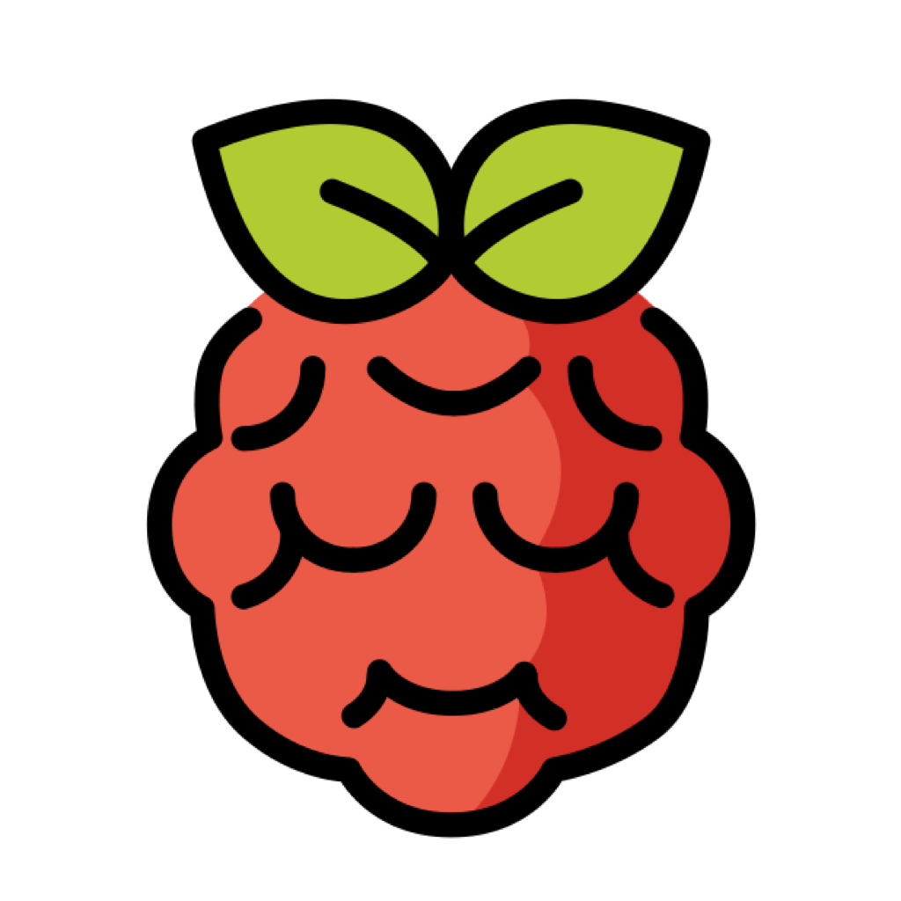

<p align="center">
  
</p>

<h1 align="center">KTN4U · 开灶</h1>

<p align="center">
  <strong>把家常菜做成「游戏」——记录、精通、随机点餐</strong>
</p>

<p align="center">
  
  
  
  
  
</p>

---

## 简介

KTN4U（**K**itchen-**T**o **N**urture **U**）是一款面向普通家庭厨师的 iOS 原生应用。核心理念是将「做饭」游戏化：

- 每道菜都有**熟练度等级**（生手 → 大师），每次下厨打卡积累 XP 自动升级
- 基于自己掌握的菜品，**智能推荐今日菜单**或手动点餐
- **冰箱食材管理**，过期前桌面小组件提醒
- 烹饪记录支持**照片 + 文字**，留存每次的厨房记忆

---

## 功能概览

| 模块 | 功能 |
|------|------|
| 🍳 **菜品库** | 两级分类浏览、添加菜品（多图/相机/相册）、备注 |
| ⭐ **熟练度系统** | XP 积累制（打卡 +5、附图 +3、写评 +2），6 个等级自动升级，升级动效 |
| 🎲 **骰子推荐** | 本地规则算法：冰箱食材优先、近期历史去重、分类均衡、熟练度过滤 |
| 📋 **手动点餐** | 分类 Tab 切换、菜品网格选取、底部托盘预览、一键保存菜单 |
| 📖 **菜单历史** | 按日期归档、复用历史菜单 |
| 🧊 **冰箱管理** | 过期状态分组（已过期/警告/正常）、左滑编辑/右滑删除、快捷过期预设 |
| 🏆 **成就系统** | 10 个可解锁成就（UserDefaults 持久化），个人主页展示解锁进度 |
| 📊 **数据统计** | 各等级菜品分布柱状图（Swift Charts）、最近烹饪时间线 |
| 🔧 **分类管理** | 拖动排序、左滑重命名、右滑删除（含受影响菜品提示） |
| 💾 **数据备份** | 全量 JSON 导出（菜品/记录/菜单/成就），系统分享面板 |
| 📦 **桌面小组件** | 冰箱预警，支持 Small / Medium / 锁屏矩形三种尺寸 |

---

## 截图预览

```
┌─────────────────┐  ┌─────────────────┐  ┌─────────────────┐  ┌─────────────────┐
│   菜品库         │  │   菜品详情       │  │   今日菜单       │  │   我的冰箱       │
│                 │  │                 │  │                 │  │                 │
│  🥩 肉类        │  │  [封面图]       │  │ 🎲 骰子推荐      │  │ ⚠ 已过期 (2)   │
│  ├ 猪肉  3道    │  │  红烧肉         │  │ 📋 手动点餐      │  │ • 五花肉 已过期  │
│  ├ 牛羊肉 2道   │  │  👨‍🍳 熟练·45XP  │  │                 │  │ • 菠菜  今天     │
│  └ 鸡鸭鹅 5道   │  │  ████░░  64%   │  │  最近菜单        │  │ ─────────────── │
│  🥦 蔬菜        │  │  [打卡按钮]     │  │ · 红烧肉·炒菠菜  │  │ ✅ 冰箱存货 (5) │
│  🍜 主食        │  │  烹饪记录       │  │ · 番茄炒蛋·米饭  │  │ • 鸡蛋  5天     │
└─────────────────┘  └─────────────────┘  └─────────────────┘  └─────────────────┘
```

---

## 技术栈

| 层次 | 技术 |
|------|------|
| **UI 框架** | SwiftUI 6（iOS 26 Liquid Glass 材质） |
| **数据持久化** | SwiftData（`@Model`、`@Query`） |
| **异步** | Swift Concurrency（`async/await`、`@MainActor`） |
| **图表** | Swift Charts（`.barMark` + 渐变 + 动画） |
| **小组件** | WidgetKit（`StaticConfiguration`、三种 WidgetFamily） |
| **图片选取** | PhotosUI（`PhotosPicker`）+ AVFoundation（`CameraView`） |
| **数据共享** | App Group UserDefaults（主 App ↔ Widget） |
| **依赖管理** | Swift Package Manager（零第三方库） |

---

## 架构设计

采用 **MVVM + Clean Architecture** 三层分层：

```
Presentation（SwiftUI View + @Observable ViewModel）
      ↕  @Query / modelContext
Domain（纯 Swift struct/protocol，零框架依赖）
      ↕  Repository Protocol
Data（SwiftData @Model + Repository 实现 + Storage 工具）
```

### 关键设计决策

| 决策点 | 方案 | 原因 |
|--------|------|------|
| 分类存储 | `parentId: UUID?` 自关联 | 二级树，nil 表顶级，无需递归 |
| 图片存储 | 沙盒文件 + SwiftData 存文件名 | 避免 Blob 拖慢 @Query |
| XP 计算 | 纯 `ProficiencyUseCase` struct | 零依赖，可单元测试 |
| 推荐算法 | `MenuRecommendationStrategy` Protocol | 初版本地规则，预留 AI 接入口 |
| 成就持久化 | `UserDefaults` | 固定 10 条 ID，无需 SwiftData |
| Widget 数据 | App Group UserDefaults | 无需共享 SwiftData schema |

---

## 项目结构

```
KTN4U/
├── App/                        # 入口 + TabView 框架
├── Domain/
│   ├── Models/                 # 纯 Swift 值对象（Dish, FridgeItem …）
│   ├── UseCases/               # 业务逻辑（ProficiencyUseCase, FridgeUseCase …）
│   └── Protocols/              # Repository & Strategy 协议
├── Data/
│   ├── SwiftData/              # @Model 持久化类 + toDomain() 映射
│   ├── Repositories/           # 协议实现（SDDishRepository …）
│   ├── Strategies/             # LocalRuleMenuStrategy（推荐算法）
│   ├── Seeding/                # DefaultCategorySeeder（首次启动预置分类）
│   └── Storage/                # ImageFileStorage / AchievementStore / ExportManager
├── Presentation/
│   ├── DishBook/               # 菜品库模块（4 个 View + ViewModel）
│   ├── Menu/                   # 菜单模块（Hub / Order / Random / History）
│   ├── Fridge/                 # 冰箱模块
│   ├── Profile/                # 个人主页 + 成就 + 图表
│   ├── Settings/               # 分类管理 + 数据管理
│   └── Components/             # 通用组件（DishCard / ProficiencyBar / LevelUpOverlay …）
├── Resources/
│   └── Assets.xcassets/        # App Icon + AccentColor + AvatarPhoto
KTN4UWidget/                    # WidgetKit Extension
KTN4UTests/                     # Swift Testing 单元测试（14 个）
```

---

## 快速开始

### 环境要求

| 工具 | 版本 |
|------|------|
| macOS | 15.0+ |
| Xcode | 26.1+ |
| iOS 设备 / 模拟器 | iOS 26.0+ |
| xcodegen | `brew install xcodegen` |

### 构建步骤

```bash
# 1. 克隆仓库
git clone https://github.com/<your-username>/ktn4u.git
cd ktn4u

# 2. 生成 Xcode 项目
xcodegen generate

# 3. 打开项目
open KTN4U.xcodeproj
```

在 Xcode 中：
- **Signing & Capabilities** → 两个 Target 均选择你的 **Team**（开启 Automatic Signing）
- 选择目标设备 → ▶ 运行

### 真机 + Widget 数据共享（可选）

Widget 实时显示冰箱预警数据需要 App Group：

1. **Apple Developer Portal** → Identifiers，为 `com.ktn4u.app` 和 `com.ktn4u.app.widget` 启用 **App Groups**
2. 创建 App Group：`group.com.ktn4u.app`
3. 在 Xcode 的 Signing & Capabilities 中为两个 Target 添加 **App Groups** → `group.com.ktn4u.app`

> 未配置 App Group 时，App 完整功能正常，Widget 展示占位数据。

---

## 单元测试

```bash
xcodebuild test \
  -project KTN4U.xcodeproj \
  -scheme KTN4UTests \
  -destination 'platform=iOS Simulator,name=iPhone 16 Pro'
```

| 测试套件 | 用例 | 覆盖内容 |
|---------|------|---------|
| `ProficiencyUseCaseTests` | 7 | XP 计算、升级检测、等级边界、进度计算 |
| `MenuRecommendationTests` | 4 | 数量限制、空池处理、熟练度过滤 |
| `CategoryTreeTests` | 2 | 顶级/子分类识别、父子关系 |
| **合计** | **14** | **全部通过** ✅ |

---

## 路线图

- [ ] AI 菜单推荐（接入 Claude API，`LocalRuleMenuStrategy` 无缝替换）
- [ ] 菜品原材料清单与冰箱联动
- [ ] iCloud 同步备份
- [ ] iPad 适配（多栏布局）
- [ ] 分享单道菜品卡片（图片导出）

---

## License

MIT © 2026 linbonan03
